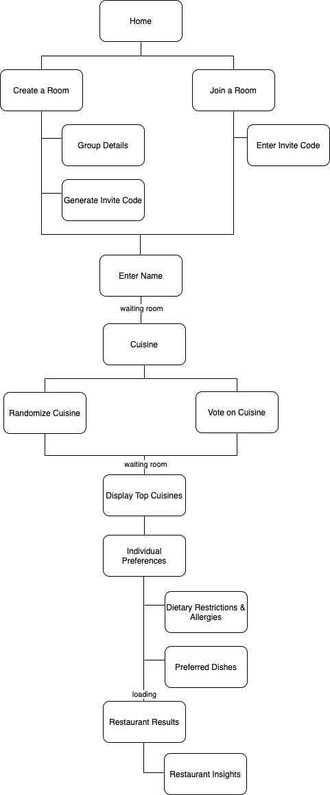

# User Experience Design

###### Team _oita-structure_ (foodwithfriends)

## Prototype
Link: https://foodwithfriends.invisionapp.com/console/share/UA350E50RM

## App Map

## Wireframes

The exported files of the completed wireframes shown below are included in the ux-design directory.

#### About Us

This is the marketing page users will see to view more information about the product.

#### Home Page

This is the main application page users will see to either create a room or join a room.

#### Enter Invite Code

This is the page users will use when a room has already been created and they want to join an existing room.

#### Create Room

This page will allow users to create a new room.

#### Get Invite Code

This page will allow users to get an invite code.

#### Enter Username

This page will allow users to enter their username to enter.

#### Waiting Room

This will be the page users see while they are waiting for a sessions to start.

#### Cuisine Vote Page

This is the page users will use to vote for a cuisine.

#### Random Cuisine

Allows user to select a random cuisine.

#### Cuisine Vote Page

Allows users to vote for a specific cuisine.

#### Cuisine Vote Slider

The view for when a user slides on the carousel.

#### Cuisine More Info

Shows more information about the card user selected.

#### Individual Preferences for Preferred Dishes

Allows a user to select individual preferences for their preferred dishes.

#### Dietary Restrictions

Select dietary restrictions (i.e Vegetarian)

#### Top Cuisine

Shows a page for the user to view their group's preferred cuisine.

#### Loading Recs

Loading screen for when recommendations are being generated.

#### Restaurant List Results

Shows list of restauraunts and the percentage match it is for the group.

#### Insights

Shows the restauraunt details such as directions, reviews, and detailed information.

